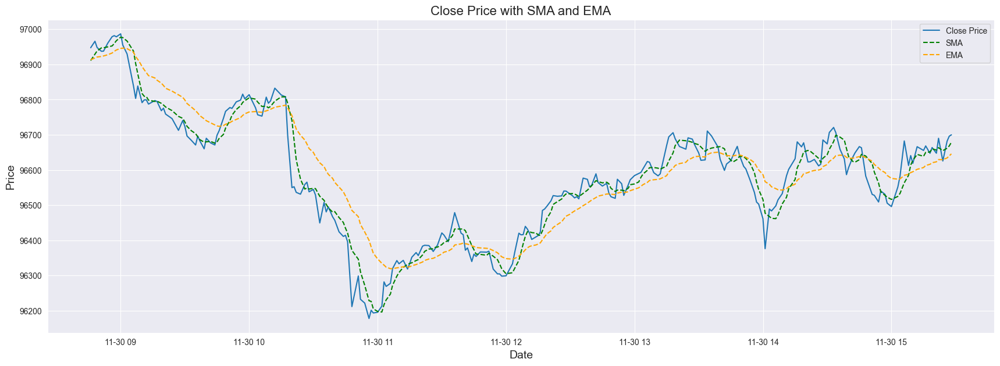
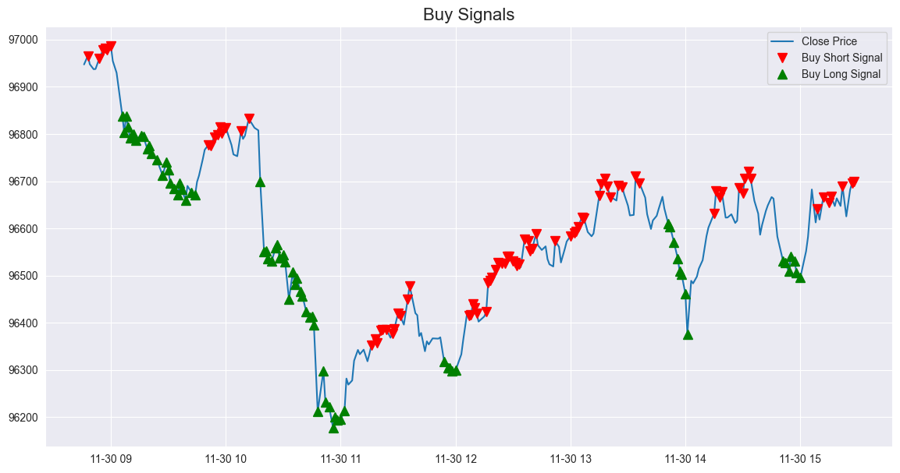
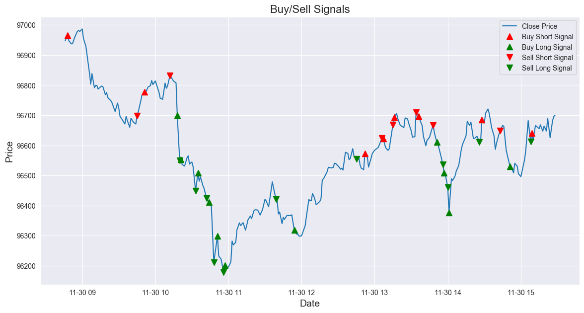
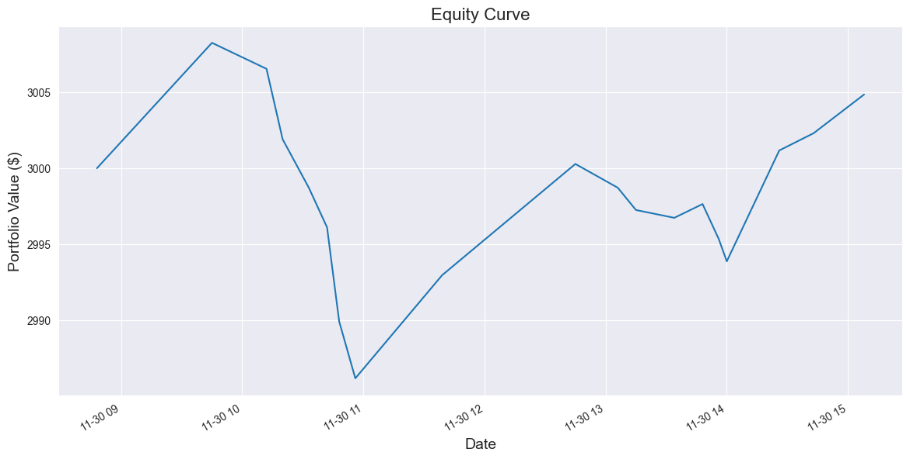

# High-Frequency Scalping Tool

A high-frequency trading tool for day trading with predictive models (TBD) and strategies based on technical indicators.
This project has the goal to provide a framework for developing and testing day trading strategies with a focus on scalping.

## 📚 Table des Matières

- [Technologies](#-technologies)
- [Functionalities](#-functionalities)

## 🚀 Technologies

- yfinance
- pandas
- scikit-learn
- TensorFlow / PyTorch
- ccxt, alpaca-trade-api
- matplotlib
- jupyter

## 🔍 Functionalities

- Fetching historical data and technical indicators.
- Tests and coverage with pytest.
- Visualizing data and technical indicator with Matplotlib and Jupyter.
- Trading operations like buy, sell, TP, SL, leverage, etc.
- Backtesting framework.
- Performance analysis and reporting.

## Explain the project

We get the data from Yahoo Finance API and we use the data to create a dataset with the technical indicators.

(SMA, EMA, RSI, MACD, Bollinger Bands, etc.)

After that, we use the dataset to define the trading strategy and place buying signals.

After that, we execute the trading signals with slippage, fees and don't know the future prices.

Finally, we analyze the equity curve, drawdown, sharpe ratio, etc.

## Notebooks

- [Data Exploration](notebooks/view_processed_data.ipynb)
